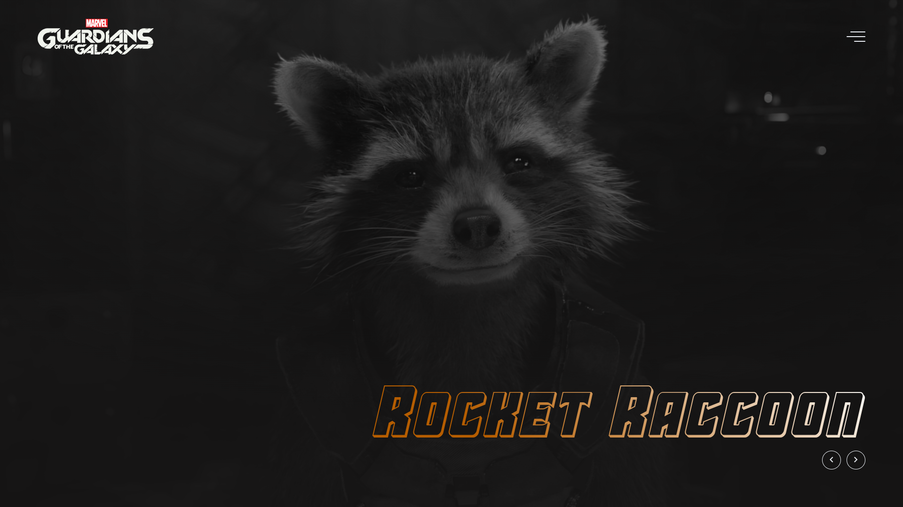

<h1 align="center"> Guardiões da Galáxia </h1>

Pagina que mostra os personagens principais de Guardiões da Galáxia, com animações especiais.  

  <a href="#-tecnologias">Tecnologias</a>&nbsp;&nbsp;&nbsp;|&nbsp;&nbsp;&nbsp;
  <a href="#-projeto">Projeto</a>&nbsp;&nbsp;&nbsp;
  

 

  

## 🚀 Tecnologias

Esse projeto foi desenvolvido com as seguintes tecnologias:

- HTML e CSS
- JavaScript
- Frameworks e Bibliotecas (outros)
- Git e Github

## 💻 Projeto

Projeto foi inspirado em versões na internet, e feito para treinar os conhecimentos Frontend.
